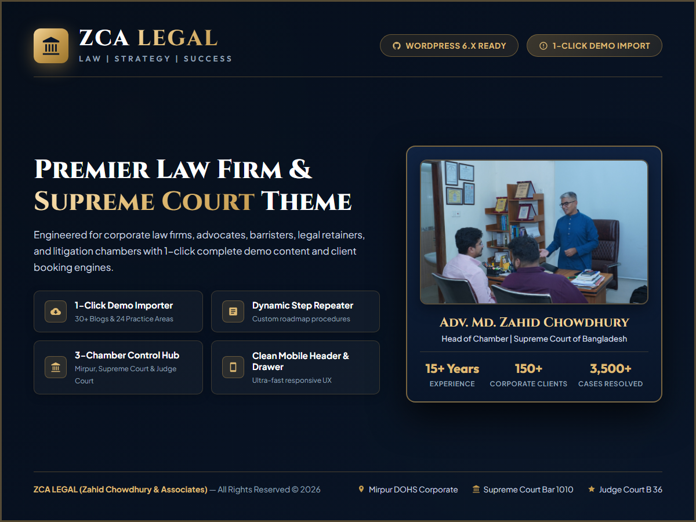

# ZCA LEGAL — Enterprise WordPress Theme for Law Firms & Advocates

**ZCA LEGAL (Zahid Chowdhury & Associates)** is a bespoke, state-of-the-art WordPress theme engineered specifically for full-service law firms, Supreme Court practitioners, barristers, corporate legal advisors, and legal retainers in Bangladesh.

---

## ⚖️ Key Features & Capabilities

### 1. 🚀 1-Click Complete Demo Data Importer
- **Automated Content Population (`ZCA LEGAL > Import Demo Data`)**:
  - Automatically creates all **9 core pages**: Home, About Us, Practice Areas Directory, Our Team, Our Clients, Monthly Retainer, Blog, Gallery, Contact Us.
  - Generates real **WordPress Categories & Taxonomies** (`Posts > Categories` and `Practice Areas > Categories`).
  - Pre-populates all **24 Practice Areas** with custom 4-step roadmap procedures & required document checklists.
  - Imports **6 categorized in-depth legal articles**, lawyer profiles, recognition awards, and navigation menus.

### 2. ⚡ Dynamic Step Repeater for Practice Areas
- Built-in **JavaScript Dynamic Repeater** in the WordPress editor.
- Law firm admins can add unlimited roadmap steps (`+ Add Another Step`), delete steps, and customize each stage's title and description.
- Automatically re-indexes and renders styled procedure cards on the frontend.

### 3. 📱 Ultra-Clean Mobile Experience & Off-Canvas Drawer
- **Clean Mobile Header**: Only the Brand Logo (left) and Menu Icon (right) are displayed on mobile headers to prevent clutter.
- **Rich Slide-in Mobile Drawer**: Displays full navigation, direct consultation triggers, Pay Online modal, Chamber Hotlines, WhatsApp, and branch directions.
- **Mobile Off-Canvas Filters**: Filter buttons for Practice Areas and Blog archives collapse into an accessible slide-in drawer on mobile viewports.

### 4. 🏢 3-Chamber Strategic Management & Theme Settings Panel
- **Centralized Control Panel (`ZCA LEGAL > Theme Settings`)**:
  - **Custom Logo Uploader**: Upload/choose PNG, SVG, or JPG brand logos directly with live preview.
  - **Chamber 1**: Mirpur DOHS Corporate Chamber (address, hotlines, map).
  - **Chamber 2**: Supreme Court Bar Chamber 1010 (address, phone, map).
  - **Chamber 3**: Dhaka Judge Court Chamber B 36 (address, phone, map).
  - **Payment Gateway Accounts**: bKash, Nagad, Rocket, Bank Transfer instructions.
  - **Hero Section Settings**: Custom advocate portrait upload & accreditation badges.

### 5. 📬 Automated AJAX Booking Engine & HTML Email Alerts
- Seamless AJAX appointment booking forms on all pages and single practice templates.
- Automatically logs entries in the custom post type `zca_booking` with status management (`Pending`, `Confirmed`, `Completed`, `Cancelled`).
- Dispatches branded HTML confirmation emails to the client and instant alert emails to chamber management via `wp_mail()`.

---

## 🛠️ Technology Stack & Standards

- **Core**: WordPress 6.x+, PHP 8.x+, HTML5, Vanilla JavaScript (ES6+), Vanilla CSS (CSS3 Variables & Design Tokens).
- **Icons & Typography**: FontAwesome 6.5.1, Google Fonts (*Cinzel*, *Outfit*, *Plus Jakarta Sans*).
- **Security**: Complete Nonce verification (`wp_verify_nonce`, `check_ajax_referer`), CSRF protection, input sanitization (`sanitize_text_field`, `sanitize_email`, `sanitize_textarea_field`), and output escaping (`esc_html`, `esc_attr`, `esc_url`).

---

## 🚀 Installation & Setup

1. Clone or download this repository.
2. Upload the `zca-legal` folder to your WordPress themes directory (`/wp-content/themes/zca-legal`).
3. In WP Admin, navigate to **Appearance > Themes** and activate **ZCA LEGAL**.
4. Go to **ZCA LEGAL > Import Demo Data** and click **"Run 1-Click Complete Demo Import"**.
5. Customize chamber details and brand logo under **ZCA LEGAL > Theme Settings**.

---

## 📄 License & Attribution

Designed & Developed for **ZCA LEGAL (Zahid Chowdhury & Associates)**.  
All Rights Reserved © 2026.
